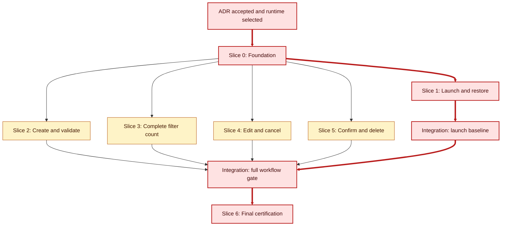

# TODO List Manager Vertical-Slice Implementation Plan

## 1. Goals and Constraints

Implement the TODO manager as a local Electron application using React, TypeScript, typed preload IPC, application services, a `TodoRepository` interface, and SQLite.

The plan must preserve these boundaries:

- One user on one device.
- No backend, authentication, synchronization, collaboration, or remote TODO-content transmission.
- Durable local persistence before a mutation is reported as successful.
- Keyboard and assistive-technology support for core workflows.
- Responsive behavior from 320 pixels through 1280 pixels.
- Up to 1,000 stored TODO items for the MVP.

This plan assumes the architecture in [ADR-001](../architecture/decisions/ADR-001-desktop-local-sqlite.md) and the stack guidance in [Electron React TypeScript Stack Instructions](../.github/instructions/electron-react-typescript-stack.instructions.md). ADR-001 remains `Proposed`; implementation should not be treated as architecture approval until the deciders accept it.

## 2. Vertical-Slice Principles

Each slice MUST:

- Deliver a user-observable capability or a demonstrable product-quality outcome.
- Cross the UI, preload/IPC, application service, repository, and SQLite layers when the behavior requires persistence.
- Include the happy path, relevant validation or failure paths, and automated tests before the slice is considered complete.
- Keep feature-specific code together rather than organizing work as separate UI, API, and database projects.
- Preserve the stable `TodoRepository` boundary so UI behavior is not coupled to SQLite details.
- Keep the application runnable after the slice is merged.

Shared infrastructure is allowed when it enables a slice, but it is not considered complete until one vertical slice exercises it end to end.

## 3. Proposed Boundaries

Use feature-oriented boundaries while keeping process boundaries explicit:

```text
src/
  shared/                  # DTOs, result types, error codes, test fixtures
  main/                    # Electron lifecycle and validated IPC handlers
  preload/                 # Narrow typed contextBridge API
  renderer/                # React shell and accessibility primitives
  features/todos/
    load-todos/            # Launch and restore flow
    create-todo/           # Create and validate flow
    complete-todo/         # Completion toggle flow
    filter-todos/          # Filter and count flow
    edit-todo/             # Edit and cancel flow
    delete-todo/           # Confirm and delete flow
  infrastructure/sqlite/   # Versioned schema, migrations, repository adapter
```

The exact directory names may change with the selected build tooling, but the ownership boundaries should remain stable.

## 4. Slice Sequence

### Slice 0: Runnable Desktop and Persistence Foundation

**Outcome**: The application launches in a packaged-like development environment and can open or create a versioned SQLite database through a repository contract.

**Scope**:

- Electron main, preload, and React renderer entry points.
- Secure defaults: context isolation enabled, renderer Node integration disabled, narrow preload bridge.
- Shared `Todo` model, result type, error codes, and `TodoRepository` interface.
- SQLite schema and migration runner for identifier, title, completion state, and creation timestamp.
- Test database factory and deterministic fixtures.
- CI commands for type checking, linting, unit tests, and a packaged-like smoke launch.

**Verification**:

- The app opens without a database and creates the initial schema.
- The renderer cannot access Node.js, SQLite, or filesystem APIs directly.
- A repository test can create a temporary database, migrate it, and close it cleanly.
- TypeScript strict checking and the baseline test suite pass.

**Dependencies**: ADR-001 acceptance, selected supported runtime and operating systems.

**Requirement links**: Data model in section 9.2, NFR-006, security constraints in ADR-001.

### Shared Contract Checkpoint

Before parallel feature implementation begins, freeze the shared contracts created by Slice 0:

- `Todo` data model and active/completed state representation.
- `TodoRepository` methods and domain-level error codes.
- Typed preload operations, IPC payloads, and serialized result shapes.
- Initial SQLite schema, migration policy, and malformed-data behavior.
- Shared test fixtures and application-state conventions.

Changes to these contracts after the checkpoint require explicit coordination because they affect every active slice.

## 5. Parallel Delivery Model

After the shared contract checkpoint, run these workstreams in parallel:

| Workstream                            | Scope                                                                             | Integration gate               |
| ------------------------------------- | --------------------------------------------------------------------------------- | ------------------------------ |
| Desktop shell                         | Electron main process, preload bridge, security defaults, window lifecycle        | Slice 1 launch flow            |
| Persistence                           | SQLite schema, migrations, repository methods, transaction and failure tests      | Slice 1 restore flow           |
| Renderer shell                        | React layout, task entry, task-row, filters, loading, empty, and error primitives | Slice 1 visible flow           |
| Test infrastructure                   | Unit, repository, IPC, renderer, and packaged-like Electron test harnesses        | Each slice adds its tests      |
| Accessibility and responsive behavior | Focus utilities, semantic controls, keyboard paths, and viewport fixtures         | Continuous with every UI slice |

The workstreams may share the frozen contracts but should not edit one another's feature-owned files. Use fixture-backed tests and fake repositories to develop user-facing slices before their full integration dependency is available.

### Implementation Versus Integration Dependencies

Track two dependency types separately:

- **Implementation dependency**: a contract, primitive, or test fixture required to write the slice.
- **Integration dependency**: a prior user flow that must be present before the slice can be demonstrated as part of the complete application.

This distinction allows Slices 2 through 5 to be implemented concurrently while preserving a coherent integration order.

### Feature Ownership Boundaries

- `src/main` and `src/preload`: desktop/platform workstream.
- `src/infrastructure/sqlite`: persistence workstream.
- `src/renderer`: renderer shell and accessibility workstream.
- `src/features/todos/<feature>`: feature owner for each slice.
- `src/shared`: contract owner; changes require review from all active workstreams.

Avoid parallel edits to shared DTOs, the repository interface, or the primary task-row component.

### Slice 1: Launch, Restore, and Empty State

**Outcome**: A user can launch the application and see either restored tasks or a useful empty state.

**Flow**:

1. Electron creates the main window and preload bridge.
2. React requests `loadTodos` through the typed bridge.
3. Main-process application service calls `TodoRepository.loadAll`.
4. The repository returns tasks or a domain-level persistence error.
5. React renders loading, task-list, empty, or persistence-error state.

**Scope**:

- `load-todos` feature.
- Loading and initial error state.
- Empty state with a next action to add a task.
- Restoration of title, identifier, completion state, and creation timestamp.

**Verification**:

- AC-007: persisted tasks survive relaunch.
- AC-008: an empty filter displays a relevant empty state.
- Restore failure displays an actionable error without pretending data was loaded.
- Keyboard focus lands on the task-entry control or the first actionable empty-state control.

**Requirement links**: FR-004, FR-009, FR-013, FR-014, NFR-002, NFR-007.

**Dependencies**: Slice 0.

### Slice 2: Create and Validate a TODO

**Outcome**: A user can create a valid active task, and invalid titles are rejected without persistence.

**Flow**:

1. The user enters a title and submits the form.
2. React sends a typed `createTodo` request through preload.
3. Main-process validation invokes the create application service.
4. The service trims surrounding whitespace, rejects blank input, creates an identifier and timestamp, and calls the repository.
5. SQLite persists the task in a transaction.
6. The service returns the saved task; React updates the list and clears the input.

**Scope**:

- `create-todo` feature.
- Shared non-blank title validation.
- Structured validation and persistence errors.
- Active-item rendering and input reset.

**Verification**:

- AC-001: exactly one valid task is created and persisted.
- AC-002: blank and whitespace-only titles are rejected.
- A failed save leaves the existing visible state explainable and shows an actionable error.
- Renderer tests verify form submission by keyboard and accessible validation feedback.

**Requirement links**: FR-001, FR-002, FR-003, FR-012, BR-001, BR-004, BR-005.

**Implementation dependencies**: Slice 0 shared contracts and the Slice 1 renderer shell primitives.

**Integration dependency**: Slice 1 launch flow; create can be developed and tested with a fake repository before Slice 1 is integrated.

### Slice 3: Complete, Filter, and Count Tasks

**Outcome**: A user can mark tasks complete, switch between All/Active/Completed, and see accurate counts.

**Flow**:

1. The user toggles completion on a task.
2. The typed `setTodoCompletion` command crosses preload IPC.
3. The application service validates the identifier and target state.
4. The repository persists the state change transactionally.
5. The feature state updates the item and recomputes active and completed counts.
6. Filter selection changes the visible projection without mutating stored items.

**Scope**:

- `complete-todo` and `filter-todos` features.
- Explicit active/completed state model.
- All, Active, and Completed filter controls.
- Active and completed counts.
- Visual and accessible completion state that does not rely on color alone.

**Verification**:

- AC-004: complete and reactivate a task without changing title or identifier.
- AC-006: filters show the correct projection without mutation.
- Counts update after create and completion changes.
- Keyboard and assistive technology tests cover filter state and completion state.

**Requirement links**: FR-007, FR-010, FR-011, FR-012, BR-002, BR-004, NFR-003, NFR-005.

**Implementation dependencies**: Slice 0 shared contracts, the Slice 1 task-list primitives, and fixture-backed task state.

**Integration dependency**: Slice 1 launch flow; create-specific count integration follows Slice 2.

### Slice 4: Edit and Cancel Task Changes

**Outcome**: A user can edit a task title, retain immutable fields, and cancel without changing persisted data.

**Flow**:

1. The user enters edit mode for a task.
2. The UI moves focus to the edit control and keeps the original value available.
3. Save sends a typed `updateTodo` request.
4. The application service trims and validates the title, preserving identifier and creation timestamp.
5. The repository persists the update before success is returned.
6. Cancel restores display mode and discards unsaved input.

**Scope**:

- `edit-todo` feature.
- Shared title validation and immutable-field rules.
- Focus management for edit, save, cancel, and validation failure.
- Recovery from failed update without losing the last saved title.

**Verification**:

- AC-003: valid edits persist and retain identifier and creation timestamp.
- Blank edits are rejected and preserve the saved title.
- Cancel does not create a new item or mutate storage.
- Persistence failure is visible and does not report durable success.

**Requirement links**: FR-005, FR-006, FR-012, FR-014, BR-001, BR-004, BR-005.

**Implementation dependencies**: Slice 0 shared contracts and the task-row/edit primitives.

**Integration dependency**: Slice 2's persisted task flow; edit implementation and tests can proceed in parallel with Slice 3.

### Slice 5: Confirm and Delete a Task

**Outcome**: A user can permanently delete a task after confirmation, and the deletion survives relaunch.

**Flow**:

1. The user invokes delete for a task.
2. The UI opens an accessible confirmation dialog and moves focus to the dialog.
3. Confirm sends a typed `deleteTodo` request; cancel closes the dialog without mutation.
4. The application service validates the identifier and calls the repository.
5. The repository deletes the item transactionally.
6. The UI removes the item, updates counts and filters, and restores focus to a logical target.

**Scope**:

- `delete-todo` feature.
- Accessible confirmation dialog.
- Permanent deletion behavior for the MVP.
- Count, filter, and empty-state updates after deletion.

**Verification**:

- AC-005: confirmed deletion removes the item from the list and durable storage.
- Relaunch does not restore a deleted item.
- Cancel leaves the item unchanged.
- Failed deletion leaves the item visible or restores it and reports an actionable error.

**Requirement links**: FR-008, FR-009, FR-011, FR-012, FR-014, BR-003, BR-004, BR-005.

**Implementation dependencies**: Slice 0 shared contracts, the task-row primitives, and the confirmation-dialog primitive.

**Integration dependency**: Slice 3's filter, count, and empty-state behavior; delete implementation and tests can proceed in parallel with Slices 3 and 4.

### Slice 6: Resilience, Accessibility, Performance, and Release Readiness

**Outcome**: The complete application passes final cross-platform certification and is ready for packaging review. Quality checks begin with the first relevant slice and continue throughout implementation.

**Scope**:

- Final fault-injection and migration-recovery certification.
- Final keyboard, screen-reader, responsive, and performance certification.
- Final network inspection proving no TODO content leaves the application.
- Installer, relaunch, update, rollback, and user-data-preservation certification.
- Final review of redacted operational logging and production security configuration.

The following checks run continuously with each applicable slice rather than waiting for Slice 6:

- Unit, repository, IPC, renderer, and smallest meaningful end-to-end tests.
- Keyboard, focus, accessible-state, and responsive checks for changed UI behavior.
- Type checking, linting, dependency scanning, and no-network checks.

**Verification**:

- FR-014, NFR-001 through NFR-007, and AC-008 through AC-009 pass.
- All Must-have requirements have passing automated or documented verification.
- The release artifact can install, launch, update, and preserve the database on every supported platform.

**Dependencies**: Integrated Slices 1 through 5, selected runtime and operating systems, and completed continuous quality checks.

## 6. Dependency Graph

The graph highlights the **critical integration path** in red: architecture/runtime approval, foundation, launch baseline, full-workflow integration, and final certification. Slices 2 through 5 remain parallel implementation branches that must all converge at the integration gate. A duration-based schedule critical path requires task estimates and is not inferred here.



The implementation branches can run concurrently after Slice 0 contracts are frozen. Integration remains staged: launch first, create second, then complete/filter/count, edit, and delete are combined into the full workflow. Slice-level tests must not depend on the full feature set being complete.

## 7. Slice-Level Test Shape

For every persisted command, create tests at these levels:

1. **Domain/application test**: validation, business rules, immutable fields, error mapping, and result behavior without Electron.
2. **Repository test**: SQL behavior, schema migration, transaction boundaries, persistence failure, and data restoration against a temporary SQLite database.
3. **IPC contract test**: payload validation, channel allowlist, serialization, and error mapping through the preload bridge.
4. **Renderer test**: visible state, keyboard interaction, accessible names, focus, empty/error states, filters, and counts.
5. **End-to-end test**: packaged-like Electron launch, user workflow, relaunch, and durable outcome.

Do not postpone all end-to-end testing until Slice 6. Add the smallest meaningful end-to-end test with each user-facing slice.

## 8. Work Item Template

Use one work item per vertical behavior or tightly coupled testable increment:

```markdown
# VS-[number]: [User-visible capability]

## User value

As a [user], I want to [action] so that [benefit].

## Requirements

- FR-[number]
- BR-[number]
- AC-[number]

## Vertical scope

- Renderer behavior:
- Preload/IPC contract:
- Application service:
- Repository and SQLite behavior:
- Tests:

## Acceptance checks

- Given [context], when [action], then [observable outcome].

## Done

- [ ] Unit, repository, IPC, renderer, and relevant end-to-end tests pass.
- [ ] Accessibility and error behavior are verified.
- [ ] No task content is logged or transmitted.
- [ ] The application remains runnable after the change.
```

## 9. Implementation Readiness and Definition of Done

Before starting implementation:

- [ ] ADR-001 is accepted or explicitly approved for development.
- [ ] Supported operating systems, Electron version, packaging tool, and title-length policy are decided.
- [ ] Malformed-database recovery behavior has a testable default.
- [ ] The repository interface and IPC error contract are agreed.

A slice is done only when:

- [ ] Its user-visible behavior works through the Electron boundary.
- [ ] Its business rules and failure paths have automated tests.
- [ ] Its storage mutation is durable before success is shown.
- [ ] Its keyboard, focus, and accessible-state behavior is verified.
- [ ] Its requirement and acceptance-criteria links are updated.
- [ ] No unrelated slice owns hidden dependencies on its implementation details.
- [ ] The application launches and the existing slice test suite passes.
- [ ] The slice respects feature ownership boundaries and does not introduce unreviewed shared-contract changes.

The MVP is ready for release only when Slice 6 passes and every Must-have requirement in the requirements document has verification evidence.

## 10. Risks and Follow-up Decisions

| Risk or decision                            | Impact                                           | Mitigation or next action                                  |
| ------------------------------------------- | ------------------------------------------------ | ---------------------------------------------------------- |
| ADR-001 remains Proposed                    | Architecture work may proceed without approval   | Assign deciders and reviewers before Slice 0 completion    |
| Supported operating systems are unspecified | Packaging and accessibility scope remain unknown | Select target platforms before packaging tests             |
| Malformed SQLite recovery is unspecified    | Restore behavior may be inconsistent             | Define safe-stop, backup, and user messaging behavior      |
| Maximum title length is unspecified         | UI layout and schema constraints may diverge     | Set a product limit before Slice 2 completion              |
| No export or backup exists                  | Local data loss cannot be recovered remotely     | Document the limitation and reassess before production use |

## 11. Traceability Summary

| Slice   | User stories                   | Functional requirements                | Acceptance criteria    |
| ------- | ------------------------------ | -------------------------------------- | ---------------------- |
| Slice 1 | US-002, US-007                 | FR-004, FR-009, FR-013, FR-014         | AC-007, AC-008         |
| Slice 2 | US-001, US-002, US-007         | FR-001, FR-002, FR-003, FR-012, FR-014 | AC-001, AC-002, AC-008 |
| Slice 3 | US-002, US-004, US-006, US-007 | FR-007, FR-010, FR-011, FR-012         | AC-004, AC-006         |
| Slice 4 | US-003, US-007                 | FR-005, FR-006, FR-012, FR-014         | AC-003, AC-008         |
| Slice 5 | US-005, US-007                 | FR-008, FR-009, FR-011, FR-012, FR-014 | AC-005, AC-008         |
| Slice 6 | All                            | NFR-001 through NFR-007, FR-014        | AC-008, AC-009         |
